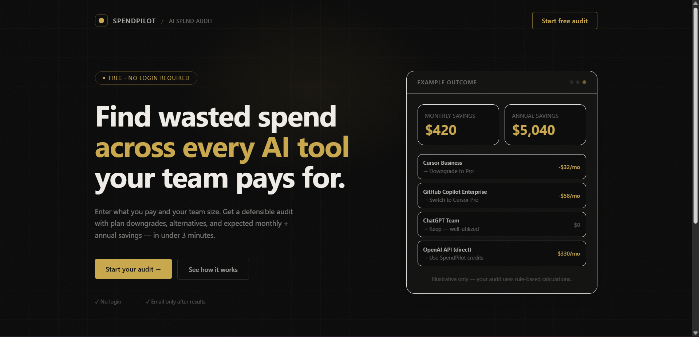
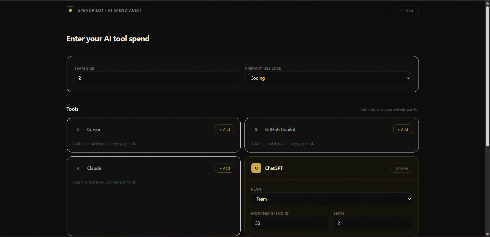
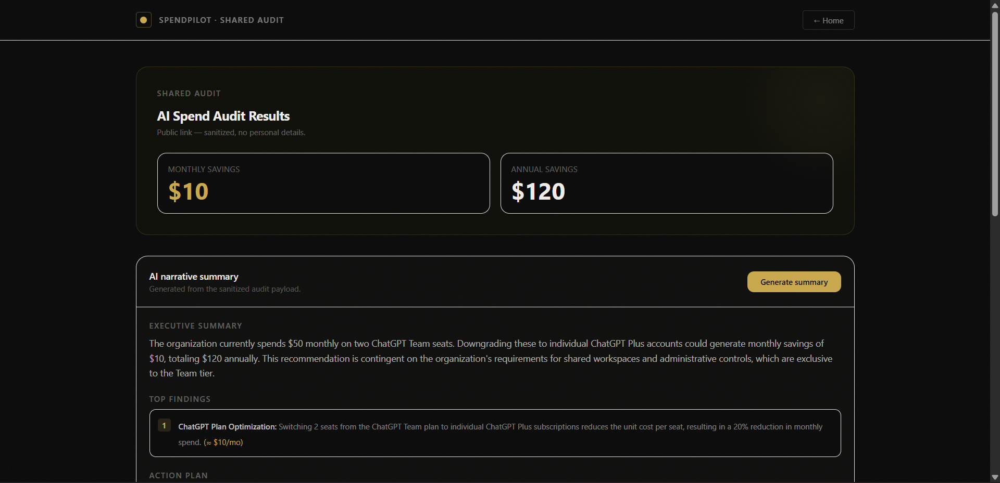
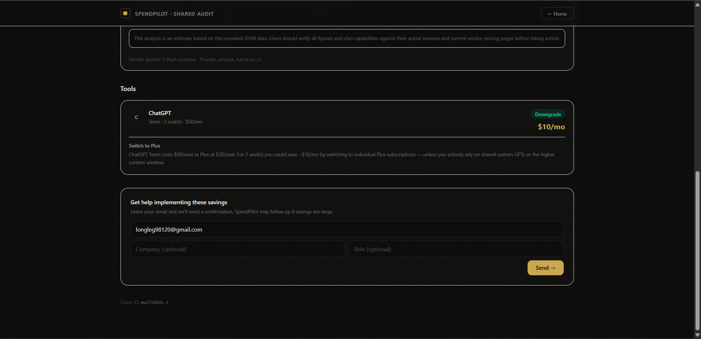

# AI Spend Audit (SpendPilot)

SpendPilot is a production-style SaaS MVP that helps small teams audit AI tool spend (subscriptions + API usage), estimate potential savings with a deterministic rule engine, and generate a shareable report link. It’s built for founders, operators, and engineering leaders who want a quick, credible spend check without a heavy procurement workflow.

The audit math is deterministic for transparency/testability; an LLM is used only to produce a narrative summary of the computed results.

## Deployed URL
- **App:** https://ai-spend-audit-ax5s5csul-vijays-projects-0cb55e04.vercel.app/

## Screenshots
- ### Landing Page

- ### Audit Form

### Results Page

### AI summary

### Email feature

## Features
- Spend input form with persistence (localStorage)
- Rule-based audit engine (no AI used for calculations)
- Results page with totals + per-tool breakdown
- Shareable public audit URLs with Open Graph + Twitter card previews
- AI-generated narrative summary (Gemini) with strict JSON schema validation + fallback template
- Lead capture (email + optional company/role) stored in Supabase, with abuse protection and confirmation email support (Resend)

## Tech stack
- Frontend: Vite + React + TypeScript + Tailwind
- Backend: Express + TypeScript
- Database: Supabase Postgres
- AI: Gemini API (narrative summary only)
- Email: Resend (optional; configured via env)

## Quick start (local)

### 1) Frontend
- `cd frontend`
- Create `frontend/.env.local`:
  - `VITE_BACKEND_BASE_URL=http://localhost:8787`
- `npm install`
- `npm run dev`

### 2) Backend
- `cd backend`
- Create `backend/.env`:
  - `SUPABASE_URL=...`
  - `SUPABASE_SERVICE_ROLE_KEY=...`
  - `GEMINI_API_KEY=...`
  - `FRONTEND_BASE_URL=http://localhost:5173`
  - Optional email:
    - `RESEND_API_KEY=...`
    - `RESEND_FROM="AI Spend Audit <onboarding@resend.dev>"`
    - `APP_BASE_URL=http://localhost:5173`
- `npm install`
- `npm run dev`

### 3) Supabase schema
Run `backend/SUPABASE_SCHEMA.sql` in the Supabase SQL editor.

### 4) Tests
- Frontend unit tests: `cd frontend && npm test`

## Deployment (one repo, two services)

### Frontend (Vercel)
1) Import the GitHub repo into Vercel
2) Set **Root Directory** to `frontend`
3) Add environment variable:
   - `VITE_BACKEND_BASE_URL=https://<your-render-service>.onrender.com`
4) Deploy

### Backend (Render)
1) Create a Render **Web Service** from the same GitHub repo
2) Set **Root Directory** to `backend` (or use commands that `cd backend && ...`)
3) Build command: `npm install && npm run build`
4) Start command: `npm start` (runs `node dist/server.js`)
5) Add environment variables (Render → Environment):
   - `SUPABASE_URL`, `SUPABASE_SERVICE_ROLE_KEY`, `GEMINI_API_KEY`
   - `FRONTEND_BASE_URL=https://<your-vercel-app>.vercel.app`
   - Optional email: `RESEND_API_KEY`, `RESEND_FROM`, `APP_BASE_URL=https://<your-vercel-app>.vercel.app`

## Decisions (trade-offs)
1) **Deterministic audit math (rule-based):** keeps recommendations explainable and testable; avoids “AI made up the numbers.”
2) **LLM used only for narrative:** Gemini improves readability, but calculations remain deterministic to reduce hallucination risk.
3) **Backend-served OG tags for share links:** social previews require server-rendered HTML; SPA-only routing isn’t reliable for crawlers.
4) **Supabase with a backend service-role key (server-only):** simplest persistence for an MVP; requires strict secret handling and never exposing the key client-side.
5) **Rate limiting + honeypot instead of CAPTCHA:** lower friction for users; reasonable baseline protection and easy to harden later.

## Docs
- `ARCHITECTURE.md`
- `PRICING_DATA.md`
- `PROMPTS.md`
- `TESTS.md`
- `DEVLOG.md`
- Business docs: `GTM.md`, `ECONOMICS.md`, `LANDING_COPY.md`, `METRICS.md`, `USER_INTERVIEWS.md`